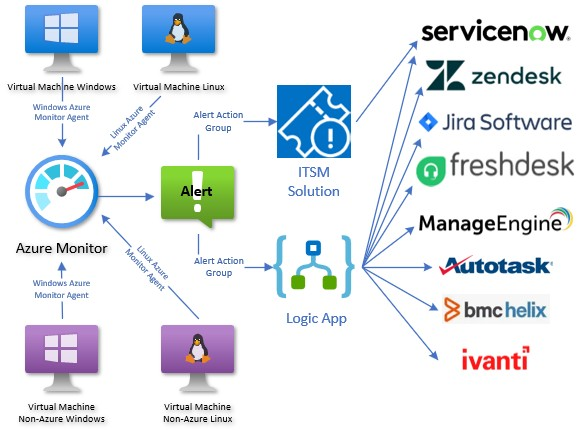

# Integrate Azure Monitor alerts with your ITSM Solution
Author: John Joyner

This solution is a bi-directional connector between Azure Monitor and any ITSM with a REST API HTTP interface. The solution will create tickets in your ITSM system when Azure Monitor alerts fire, update the ITSM as alert status changes, and write ITSM ticket data back to the Azure Monitor alert history to keep alerts and tickets in sync. The solution respects suppression alert processing rules and securely stores the ITSM service principal secrets in Azure Key vault.

There are two (2) Logic apps that are part of this solution:

1. <b>Azure-Monitor-Alert-ITSM-HTTP-API</b> (Configured as an Azure Monitor Alert Action Group action, launched every time an Azure Monitor alert condition changes.) Consumption plan Logic App has one (1) trigger and 58 actions.

2. <b>Azure-Monitor-Close-ITSM-HTTP-API</b> (Configured as a webhook destination, called by the ITSM when an Azure Monitor alert-sourced ticket is closed in the ITSM.) Consumption plan Logic App has one (1) trigger and six (6) actions.

### Click to Deploy Azure-Monitor-Alert-ITSM-HTTP-API to Azure

### Click to Deploy Azure-Monitor-Close-ITSM-HTTP-API to Azure

### IMPORTANT POST DEPLOYMENT STEPS

<b>Extensive customization of this Logic App is required before it will work in your environment.</b> 

Read the detailed step-by-step instruction at this link: https://blog.johnjoyner.net/integrate-azure-monitor-alerts-from-servers-with-your-itsm-system/

